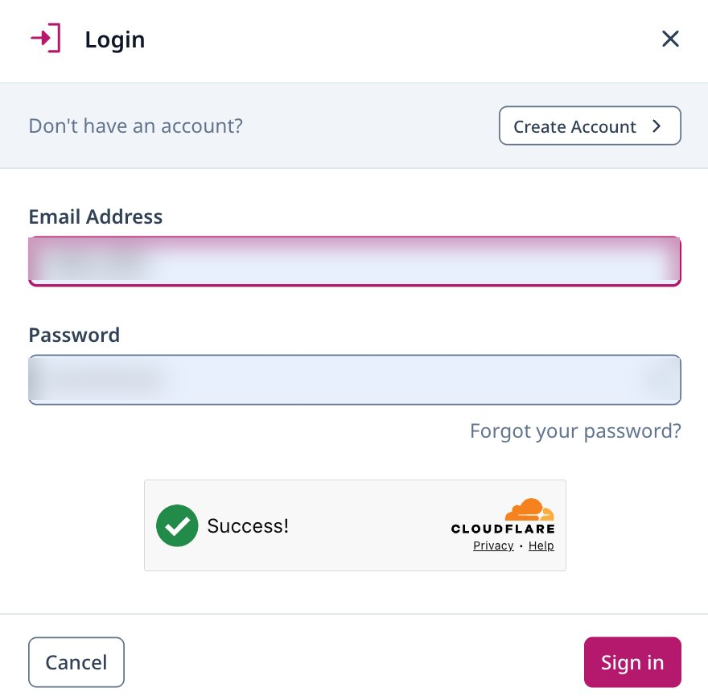
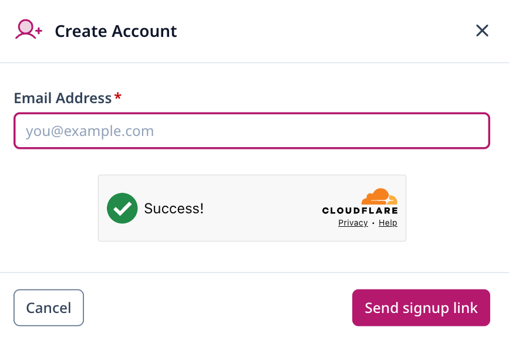
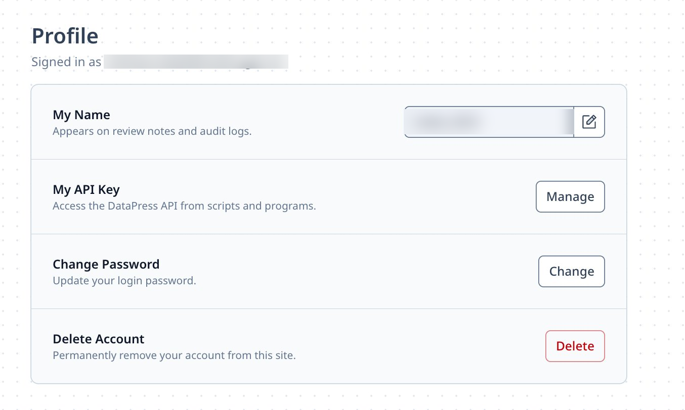

# Getting your London Datastore API key

Most public datasets on the [London
Datastore](https://data.london.gov.uk) can be downloaded without signing
in, but a few things need an **API key**:

- reading private (unpublished) datasets,
- adding, replacing or deleting resources on a dataset you own.

An API key is just a long string of characters that identifies your
account when `ldndatar2` talks to the Datastore. This guide walks
through getting one, whether you already have a Datastore account or are
starting from scratch. No prior experience with APIs is assumed.

The whole process takes a couple of minutes.

## 1. Go to the London Datastore

Open [data.london.gov.uk](https://data.london.gov.uk) in your browser.
You should see the Datastore homepage.


The London Datastore homepage.

## 2. Open the login dialog

In the top-right corner of the page, click **Login**. It sits just above
the search box.


The Login link sits in the top-right corner.

A small dialog will pop up. What you do next depends on whether you
already have a Datastore account.



The login dialog.

### If you already have an account

Enter your email address and password and click **Sign in**. Skip ahead
to [step 4](#step-4).

### If you don’t have an account yet

Click **Create Account** in the top right of the dialog. You’ll be asked
for your email address.



Creating a new account.

Type in your email and click **Send signup link**. The Datastore will
email you a link to finish setting up your account — open the email and
follow the link to choose a password. Once that’s done, come back to
[data.london.gov.uk](https://data.london.gov.uk) and sign in using the
login dialog from step 2.

## 3. Open your profile

Once you’re signed in, a small cog icon appears in the top-right of the
page. Click it and choose **My Account** from the menu.


The account menu under the cog icon.

This takes you to your **Profile** page, which lists a few account
settings, including your API key.



Your Profile page.

## 4. Reveal and copy your API key

Find the **My API Key** row and click **Manage**.

A dialog opens showing your key — a string that looks something like
`xxxxxxxx-xxxx-xxxx-xxxx-xxxxxxxxxxxx` (a UUID). Click the copy icon
next to the key to copy it to your clipboard.


The API key dialog. Treat the key like a password.

> **Keep this key safe.** Anyone with your API key can act on the
> Datastore as you. Don’t paste it into shared documents, don’t commit
> it to a Git repository, and don’t share it in screenshots or chat
> messages.

## 5. Store your key so R can use it

The cleanest way to use the key with `ldndatar2` is to save it as an
environment variable called `LDS_API_KEY`. That way it isn’t sitting in
your R scripts where it might be shared by accident.

The easiest place to set it is your user-level `.Renviron` file. From an
R session, run:

``` r

usethis::edit_r_environ()
```

This opens `.Renviron` in your editor. Add a single line:

``` ini
LDS_API_KEY=xxxxxxxx-xxxx-xxxx-xxxx-xxxxxxxxxxxx
```

Replace the example value with the key you just copied. Save the file
and **restart R** (in RStudio: *Session → Restart R*) so the new
variable is picked up.

You can check it’s working by running:

``` r

Sys.getenv("LDS_API_KEY")
```

R should print your key back to you.

## 6. Use it with `ldndatar2`

You can now pass the key to any `ldndatar2` function that needs it. For
example, to download metadata for a private dataset:

``` r

library(ldndatar2)

metadata <- lds_download_metadata(
  slug = "your-private-dataset-slug",
  api_key = Sys.getenv("LDS_API_KEY")
)
```

Or to add a new resource to a dataset you own:

``` r

lds_add_resource(
  slug    = "your-dataset-slug",
  path    = "path/to/your-file.csv",
  title   = "Your resource title",
  api_key = Sys.getenv("LDS_API_KEY")
)
```

## If something goes wrong

- **The Manage button does nothing.** Make sure you’re signed in — your
  email address should be shown at the top of the Profile page.
- **The API call returns a 401 or 403 error.** Double-check the key is
  copied in full with no extra spaces, and that you restarted R after
  editing `.Renviron`.
- **You’ve lost or leaked your key.** Go back to the API key dialog
  (steps 3 and 4) and use the **⋮** menu next to the key to regenerate
  it. The old key will stop working immediately.
